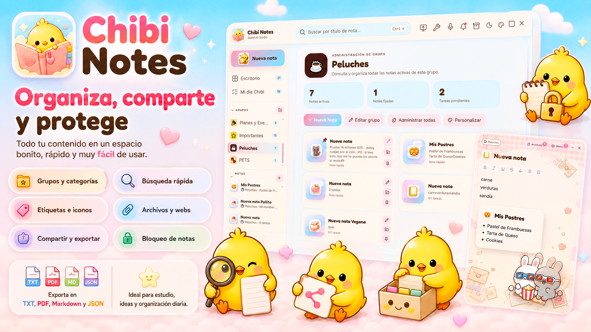
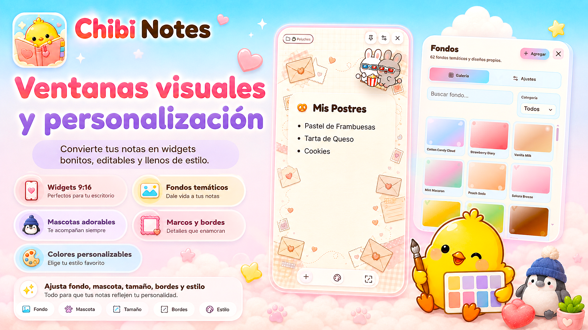
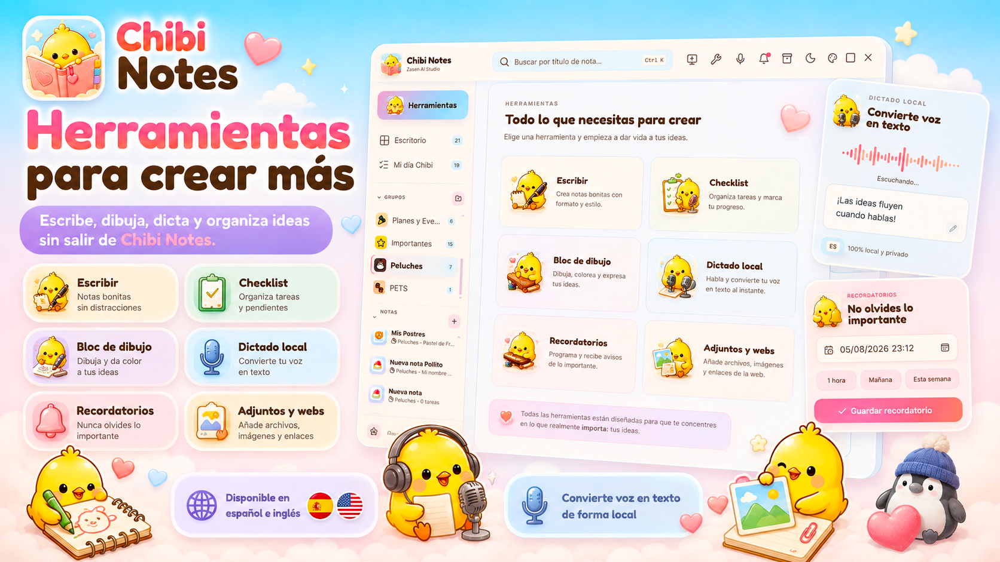

<div align="center">
  
  <h1>🌸 Chibi Notes</h1>
  <p><strong>Gestor de notas visuales y kawaii para Windows</strong></p>
  <p>
    Organiza tus ideas, crea widgets visuales y personaliza cada nota
    con una experiencia suave, adorable y moderna creada por <strong>Zazen AI Studio</strong>.
  </p>

  <p>
    
    
    
    
  </p>

  <p>
    
    
    
  </p>
</div>

---

## 🌷 Vista general

<p align="center">
  
</p>

**Chibi Notes** es una aplicación de escritorio para **Windows 10 y 11** que combina un gestor de notas completo con una experiencia visual **kawaii, flexible y centrada en la productividad**.

Permite crear y organizar notas desde un dashboard central, trabajar con tareas y recordatorios, vincular archivos y páginas web, utilizar herramientas creativas y abrir cualquier nota como una **ventana visual independiente en formato 9:16**.

La identidad del proyecto está protagonizada por **Chibi**, una pequeña mascota que acompaña al usuario dentro de una interfaz pastel, amable y altamente personalizable.

---

## ✨ Qué hace Chibi Notes

- 📝 **Crea y edita notas** con texto enriquecido, iconos y contenido visual.
- 🗂️ **Organiza tus ideas por grupos, categorías y etiquetas**.
- ✅ **Gestiona checklists y tareas pendientes** desde cada nota.
- 🖌️ **Convierte notas en widgets visuales 9:16** para el escritorio.
- 🎨 **Personaliza fondos, mascotas, marcos, colores, tipografías y sonidos**.
- 🎙️ **Convierte voz en texto de forma local** en español e inglés.
- 🔔 **Programa recordatorios nativos de Windows**.
- 📎 **Conecta archivos, imágenes y páginas web** con tus notas.
- 🔒 **Bloquea contenido y conserva tus datos en local**.
- 📤 **Exporta en TXT, PDF, Markdown y JSON**.

---

## 🐥 Características principales

### 🗂️ Organización visual de notas

<p align="center">
  
</p>

Chibi Notes reúne todas tus ideas dentro de un dashboard visual y fácil de explorar:

- **Grupos personalizados** con nombre, color e icono.
- **Categorías, etiquetas e iconos kawaii** para identificar contenido.
- **Notas fijadas, archivadas y organizadas** desde un único espacio.
- **Métricas por grupo** con notas activas, fijadas y tareas pendientes.
- **Búsqueda rápida** por título y contenido.
- **Archivos y webs vinculados** a cada nota.
- **Exportación** a formatos comunes.
- **Bloqueo de notas** para proteger contenido importante.

Cada nota puede moverse, clasificarse, personalizarse y reutilizarse sin perder su identidad visual.

---

### 🌸 Ventanas visuales y personalización

<p align="center">
  
</p>

Cualquier nota puede abrirse como una ventana visual independiente para utilizarla como recordatorio, lista, panel decorativo o widget de escritorio.

Cada ventana conserva sus propios ajustes:

- **Formato vertical 9:16**.
- **Fondo temático o imagen personalizada**.
- **Mascota integrada o importada por el usuario**.
- **Tamaño, escala, posición y redondeado**.
- **Transparencia, desenfoque y efecto de vidrio**.
- **Marcos, bordes, colores y tipografías**.
- **Controles para fijar, mover, personalizar y cerrar**.

Los fondos personalizados se recortan y optimizan automáticamente. Chibi Notes calcula además una paleta compatible para mantener la legibilidad de la nota.

---

### 🎙️ Herramientas creativas y productividad local

<p align="center">
  
</p>

El centro de herramientas reúne funciones para crear, organizar y transformar ideas sin salir de la aplicación:

- **Escritura enriquecida** para notas libres.
- **Checklists** y seguimiento de tareas.
- **Bloc de dibujo** para bocetos rápidos.
- **Dictado local** en español e inglés mediante Vosk.
- **Recordatorios** con accesos rápidos de fecha y hora.
- **Adjuntos, imágenes y enlaces web**.
- **Búsqueda, modo estudio y texto a voz**.
- **Opciones de exportación y protección**.

El reconocimiento de voz se realiza de forma local y no necesita enviar el audio a servicios externos.

---

## 🚀 Funcionalidades destacadas

<div align="center">

| Función | Descripción |
|---|---|
| 📝 **Editor de notas** | Escribe, da formato, añade tareas y organiza contenido visual. |
| 🗂️ **Grupos inteligentes** | Clasifica notas mediante grupos, categorías, etiquetas e iconos. |
| 🖌️ **Widgets 9:16** | Abre notas como ventanas independientes y personalizables. |
| 🎨 **Personalización avanzada** | Cambia fondos, mascotas, marcos, bordes, colores y tipografías. |
| 🎙️ **Dictado local** | Convierte voz en texto en español o inglés mediante Vosk. |
| 🔔 **Recordatorios** | Programa avisos de Windows desde la propia nota. |
| 📎 **Archivos y webs** | Vincula recursos locales y páginas web a cada nota. |
| 🔒 **Privacidad local** | Guarda datos mediante SQLite y protege notas importantes. |
| 📤 **Exportación múltiple** | Exporta contenido en TXT, PDF, Markdown y JSON. |
| 🔊 **Experiencia sonora** | Personaliza sonidos de navegación, acciones y avisos. |

</div>

---

## 🎀 Biblioteca visual incluida

Chibi Notes incorpora una amplia colección de recursos para que cada espacio tenga una identidad propia:

| Recurso | Cantidad | Uso principal |
|---|:---:|---|
| 🖼️ **Fondos temáticos** | **62** | Personalización del editor principal. |
| 📱 **Fondos verticales 9:16** | **74** | Ventanas visuales y widgets. |
| 🐾 **Mascotas** | **662** | Decoración y acompañamiento visual. |
| 🌈 **Iconos kawaii** | **422** | Identificación de notas y grupos. |
| 🐥 **Ilustraciones funcionales** | **20** | Centro guiado de herramientas. |
| 🖌️ **Marcos y bordes** | **12** | Estilos visuales estáticos y animados. |
| 🔊 **Efectos de sonido** | **23** | Navegación, acciones y recordatorios. |
| 🔤 **Tipografías** | **49** | Personalización del contenido. |
| 🎨 **Paletas de interfaz** | **8** | Apariencia global de la aplicación. |

---

## 🔐 Privacidad y funcionamiento local

Chibi Notes está diseñado para que las funciones principales trabajen directamente en el equipo del usuario:

- 🏠 Las notas y preferencias se guardan mediante **SQLite**.
- 🎙️ El dictado utiliza modelos locales de **Vosk**.
- 🔊 El texto a voz utiliza las voces instaladas en Windows.
- 👤 No es necesario crear una cuenta para usar la aplicación.
- ☁️ La gestión principal de notas no depende de servicios en la nube.
- 🔒 Las notas pueden bloquearse desde la propia interfaz.

> **Privacidad por diseño:** tus ideas permanecen en tu equipo mientras utilizas las funciones locales de Chibi Notes.

---

## 🧰 Tecnologías utilizadas

### Frontend
- **React 19**
- **TypeScript**
- **Vite**
- **Framer Motion**
- **Zustand**

### Aplicación de escritorio
- **Tauri 2**
- **Rust**

### Backend y persistencia
- **Python**
- **SQLite** con WAL
- **Vosk** para reconocimiento de voz local
- **PortAudio** para captura de audio

### Distribución
- **NSIS** para generar el instalador `.exe`
- **PyInstaller** para crear el sidecar de Python
- **GitHub Actions** para compilación y publicación

---

## 📦 Instalación

### Descargar la versión compilada

En [**GitHub Releases**](../../releases/latest), descarga:

```text
Chibi-Notes-v0.4.26-Setup-x64.exe
```

Pasos recomendados:

1. Cierra cualquier versión anterior de Chibi Notes.
2. Ejecuta el instalador.
3. Sigue el asistente de instalación.
4. Abre Chibi Notes desde el menú Inicio o el acceso directo.

> **Nota:** Windows SmartScreen puede mostrar una advertencia mientras el ejecutable no disponga de un certificado comercial de firma de código. Descarga siempre el instalador desde el repositorio oficial de **Zazen AI Studio**.

---

## 🛠️ Compilación local

### Requisitos

- Windows 10 u 11 de 64 bits
- Node.js LTS y npm
- Python 3.10, 3.11, 3.12 o 3.13
- Rust estable con toolchain MSVC
- Visual Studio Build Tools con **Desktop development with C++**
- Windows SDK
- Microsoft Edge WebView2 Runtime

### Preparación automática

```bat
scripts\SETUP_WINDOWS.cmd
```

El script prepara las dependencias, crea el entorno virtual de Python, descarga los modelos ligeros de Vosk, genera el sidecar y configura Tauri.

### Ejecutar en desarrollo

```bat
npm run tauri:dev
```

Para revisar únicamente la interfaz web:

```bat
npm install
npm run dev
```

### Generar el instalador

```bat
CREAR_EXE_WINDOWS.cmd
```

Los resultados compilados se copian en:

```text
release\
src-tauri\target\release\bundle\nsis\
```

Consulta [`docs/BUILD_WINDOWS.md`](docs/BUILD_WINDOWS.md) para la guía completa.

---

## 🗂️ Estructura del proyecto

```text
Chibi-Notes/
├─ .github/                 # workflows y plantillas de GitHub
├─ backend/                 # sidecar Python, SQLite, Vosk y PyInstaller
├─ docs/                    # arquitectura, compilación y recursos del README
├─ public/assets/           # fondos, mascotas, iconos, sonidos y branding
├─ scripts/                 # preparación, ejecución y compilación para Windows
├─ src/                     # interfaz React + TypeScript
├─ src-tauri/               # aplicación nativa Tauri + Rust
├─ CHANGELOG.md
├─ CONTRIBUTING.md
├─ CREAR_EXE_WINDOWS.cmd
├─ LICENSE
├─ README.md
└─ package.json
```

---

## 🚧 Estado del proyecto

La versión pública actual es **0.4.26** y el proyecto se encuentra en desarrollo activo.

Los cambios relevantes están documentados en [`CHANGELOG.md`](CHANGELOG.md).

Puedes utilizar [**GitHub Issues**](../../issues) para:

- 🐞 Reportar errores reproducibles.
- 💡 Proponer nuevas funciones.
- 🎨 Sugerir mejoras visuales o de accesibilidad.
- 🎙️ Comunicar incidencias relacionadas con dictado o audio.

Las contribuciones, traducciones, redistribuciones y versiones derivadas requieren autorización previa de **Zazen AI Studio**. Consulta [`CONTRIBUTING.md`](CONTRIBUTING.md).

---

## 🔐 Licencia y uso

Este proyecto se publica bajo la licencia personalizada **Zazen AI Studio Personal Use License 1.0**.

Chibi Notes es software de código visible, pero **no se distribuye bajo una licencia de código abierto**.

### Resumen importante

- ✅ Se permite el **uso personal, educativo e interno**.
- ✅ Puede instalarse en dispositivos Windows controlados por el usuario.
- ✅ El código puede examinarse con fines de aprendizaje.
- ❌ **No se permite vender, redistribuir, sublicenciar ni republicar** el software.
- ❌ **No se permite reutilizar** la marca, personajes, imágenes, iconos, fondos, sonidos ni identidad visual sin autorización expresa.
- ❌ **No se permiten versiones derivadas públicas o redistribuidas** sin permiso previo por escrito.

Lee el texto completo en [`LICENSE`](LICENSE).

---

## 👤 Autor

<div align="center">
  
  <h3>Zazen AI Studio</h3>
  <p>Proyecto creado y mantenido por <strong>Samuel Acosta Fernández</strong>.</p>
</div>

---

## 💗 Identidad del proyecto

**Chibi Notes** no es solo un gestor de notas: es una experiencia visual pensada para que **organizar ideas se sienta más agradable, más personal y más creativo**.

Si te gusta el proyecto, puedes apoyarlo de estas formas:

- ⭐ Darle una estrella al repositorio.
- 🌸 Compartir Chibi Notes mediante su repositorio oficial.
- 🐞 Reportar errores o sugerir mejoras.
- 💬 Compartir cómo utilizas tus notas y widgets.

---

<div align="center">
  
  <p><strong>Tus ideas merecen un espacio kawaii. Chibi las guarda contigo.</strong></p>
</div>
